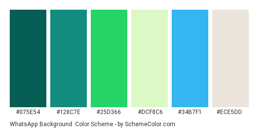
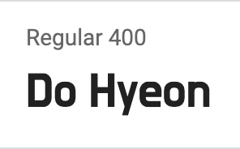
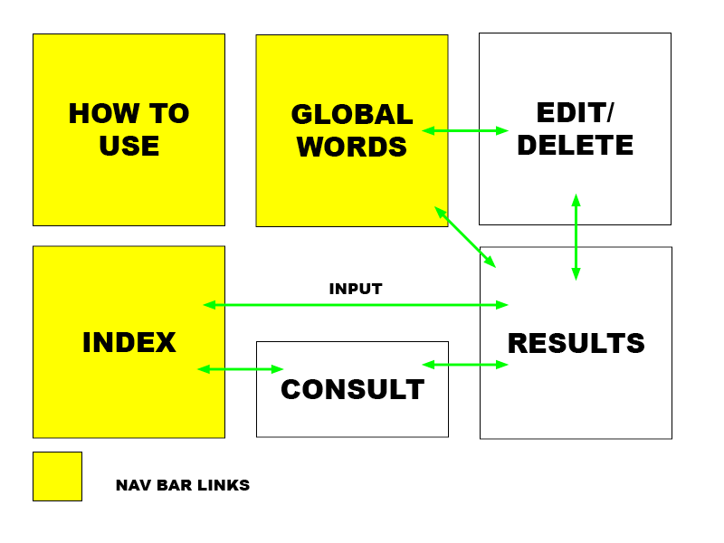

# What's the word?

What's the word? is a web application that can extract information from a WhatsApp chat:<br/>
[See here the live version](http://fergabi17-whats-the-word.herokuapp.com/)

From a text file containing a WhatsApp history, this app can extract:
- How many messages were sent
- The participants of the chat
- The number of messages each participant sent
- The length of time in months
- The most common words
- The most common word combination
- The longest word
- An analysis counting the number of characters per message to test if [Benford's law](https://en.wikipedia.org/wiki/Benford%27s_law) applies

This data is presented to the user in a single page in a story format.

The users can:
- Get a short story based on the information from their WhatsApp chat
- Edit participant's names
- Check the information kept from their session on the database
- Exclude some information from their results
- Completely delete their session's data from the database
- Consult results from a previous session with their session id
- Share their results page
- Check the average results from all inputs the webapp received

The web app also includes a how to use page to show how to export a WhatsApp history in a text format.
With all the data collected, a page called global words is created: this page shows how many messages were checked by the app so far, the most common words of all users and also the average result for all Benford's law graphics from all users' inputs.
 
## UX


### PROJECT IDEA: WhatsApp words checker
The users of this app are WhatsApp users that also enjoy checking their personal along time. It's being common now that apps present to the users a balance of their behavior in the past week, month or even year. Music, photos, social media and even banks are presenting an analysis of the user's data in their apps. From this, the idea of creating a tool that could extract information of a personal chat was born.

### STRATEGY PLANE

Basic website objectives:
- Gather data about common words in a WhatsApp chat
- Apply Benford's law on a large amount of random data
- Gather data about ignored words from users

User needs:
- WhatsApp users that would like to have a personal analysis of their chat
- Mathematic enthusiasts that would like to check the data collected to validate Benford's law
- WhatsApp users that would like to share an analysis of their chat

### SCOPE PLANE

Functions:
- Upload a text file from WhatsApp and get a result
- Exclude data about your chat from the results and database
- Delete completely the data from your chat
- Consult the results with a session id
- Consult the global results

Features:
- Exclude words from your result
- Edit chat participants names
- Share results

Future implementation
- Separate inputs according to language
- Add most common user's ignored words to the main functionality

### STRUCTURE PLANE

Find Here the wire frames for the information architecture:

[Wireframes](https://fergabi17.github.io/whats_the_word/resources/wireframes/wireframes.html)

### SKELETON PLANE

Website main colors:</br>



Website fonts:</br>
</br>
</br>


### SURFACE

Find the project live on http://fergabi17-whats-the-word.herokuapp.com/

User Stories:
- A user wants to find out the most common word in a WhatsApp chat: on the main page, the user loads a text file with the WhatsApp history clicking on the "chose file" button. Next, they click on "Check this chat". This button will bring the results page for that specific chat.

- A user wants to exclude specific words from their result: on the main page, the user adds those words in the text box bellow  "chose file" button. Then, they can load their text file and check the results excluding the selected words.

- A user needs to consult a previous session result: from the main page, they click on "You can consult data from a previous session with your session id here". They enter the session's id and they click consult. The results will be presented if the session id was found.

- A user wants to edit chat's participants names: From the results page or from the edit results page, they click on "Update Names". A new area will be revealed, with all names in a text input format. They can edit the inputs and click on "change".

- A user wants to see the data stored from their session: at the bottom of the results page, they can click on "Restrict the use of this data"

- A user wants to exclude some data from their session: at the bottom of the results page, they can click on "Restrict the use of this data". From there, above the information they would like to exclude, they click on "remove".

- A user wants to delete their full session's data: at the bottom of the results page, they can click on "Restrict the use of this data". From there, they go to the bottom of the page and click on "Delete all my results"

- A user wants to check the global results: they can click on "global words" from any page on the navigation bar

- A user doesn't know how to extract a WhatsApp chat: they can consult the "how to use" from any page on the navigation bar


## Technologies Used

- [Html](https://html.com)
    - The project uses HTML5, standard markup language for creating Web pages.

- [CSS](https://www.css3.info)
    - The project uses CSS to style the website.

- [Javascript](https://www.javascript.com/)
    - The project uses javascript for the website functionalities

- [Charts JS](https://www.chartjs.org/)
    - Charts JS was used to present user's data and global website data

- [Python](https://www.python.org/)
    - The project uses python to process data

- [Flask](https://flask.palletsprojects.com/en/1.1.x/)
    - The project uses flask for routing

- [Jinja](https://jinja.palletsprojects.com/en/2.11.x/)
    - Jinja templates to render html from python

- [MongoDB](https://account.mongodb.com/)
    - Used to store the website's database

- [Bootstrap](https://getbootstrap.com)
    - The project uses the grid system from BOOTSTRAP to get the website responsive.

- [Regex Tester](https://regex101.com/)
    - Consulted to test and validate regex used

- [Google fonts](https://fonts.google.com/)
    - Used as a source for all fonts
    
- [Scheme Colour](https://www.schemecolor.com/)
    - To generate the green colour scheme 

- [Google Chrome](https://www.google.com/chrome/)
    - This project used google CHROME browser and its developer tools.

- [Mozilla Firefox](https://www.mozilla.org/en-US/firefox/new)
    - This project used MOZILLA FIREFOX browser for testing

- [Safari](https://www.apple.com/safari/)
    - This project used SAFARI browser for testing

- [Visual Studio Code](https://code.visualstudio.com/)
    - This project was built using Visual Studio Code IDE.

- [Git](https://git-scm.com/)
    - The project used GIT for Version Control.

- [GitHub](https://github.com/)
    - This project used GITHUB for files repository.

- [Am I Responsive](http://ami.responsivedesign.is)
    - This tool was used for testing the responsiveness of the website.

- [Html validator](https://validator.w3.org/nu/#textarea)
    - This tool was used to validate the website's HTML code.

- [Css validator](https://jigsaw.w3.org/css-validator/validator)
    - This tool was used to validate the website's CSS code.
    

## Testing

You can find a text file that can be used to test this app on resources/Test_file

### Input types

As the input is a text file, regular expressions are used to first go through the data. To split the text file in messages, it is necessary to find the beginning of each message. This is made creating a pattern that could match the date, time and name on the beginning of each message - what I call prefix. 

Each phone type can export a slightly different prefix in a text message. The first tests consisted on testing inputs extracted from different phones, trying to find all the variations. The examples bellow can illustrate some cases:
- 07/07/2019, 17:37 - Participant's name:
- ‎[19/07/2020 19:46:25] Participant's name:
- [13/04/2019, 17:46:57] Participant's name:

A pattern was created to match them all and tested on [Regex Tester](https://regex101.com/).

### Popular words

With the prefixes found, they could be excluded from the search for popular words. If this isn't done, names from the prefix would always appear in the results. 

When first testing the most popular words from the chat, some issues started to appear:

- Media</br>
If there was a fair amount of media shared on the chat, the media type would be the one popping up on top of the results. Even though this isn't actually a word typed by the user, it's still a very interesting information to extract. From here, a list with the possible words representing the types of media was created. This list was ignored when searching for popular words, but used to count all the media sent.

- Language</br>
When testing for media types to be excluded, the language used became important. To search for media in a chat exported in English is different than in a chat in Portuguese or French. At this point, some tests were done with inputs generated in English and in Portuguese. Some examples bellow:</br>
    - "file omitted"</br>
    - "image attached"</br>
    - "imagem ocultada"</br>
    - "vídeo anexado"</br>

- Meaningless popular words</br>
According to the tests made on both languages, when a search for common words is made, the probability of articles, prepositions and pronouns to appear first is huge. But those words don't seem to bring a lot of meaning to a result, since they appear in basically all chats. From this, a list with main ignored words was created. Also in English and Portuguese, this list includes words that are excluded from the result.

Unfortunately this won't cover all cases that can appear on a user's input. But from this point, the necessity of a field where the user could add their own words to be ignored became evident.

### Longest word

The longest word was an easy functionality to be created. But with the results from the tests, a couple of issues were raised:

- Links</br>
If we consider a long word the same thing as a sequence of word characters, the result can bring up parts of what was actually a link, and not really a word. For this search to be effective, first it was needed to exclude all links from the body of the messages. Just like for media types, a pattern was created to match and exclude all links from the search for popular and long words. As it is still an interesting information to have, the quantity of links has its own search and it's part of the user's results.

- Overflow hidden</br>
When testing how to spot the longest word, a very, very long word could appear. Sometimes it was not even a word, but someone laughing like "hahahahahha" repeated so many times that it would be impossible to fit this word on a screen. When testing the possible outcomes for the longest word result, it was very clear that all the div elements that presented user's input should be styled as overflow:hidden.

### The monthly use of a word
After gathering information about the most popular words, it came to my mind it would be also be very interesting to see how was the use of this word along time. Has its frequency decreased or increased? To get this information, it was necessary to find out how many times the popular word was said each month. 

After getting this information, in its test phase I realized the numbers were different than expected. Adding the monthly numbers was resulting on a different value than total appearances of that same word on the chat. After a couple o print() statements followed by comparison with the original text file, I found out two issues were causing this:

- Line breaks inside a message</br>
At this point, the parameters used to match a message were:</br>
    - the prefix would mark the beginning </br>
    - a line-break/new paragraph would mark the end</br>

In this scenario, anything that appeared after a line break on a message wouldn't be considered as part of the message. So, if the word we were looking for was typed after a line break inserted bu the user, it wasn't counted on the monthly result. To solve this, before creating an array with all the messages, the line breaks in the middle of a message had to be cleaned. After this, I was sure all the line breaks that were still there could be used as a message separator.

- The word appeared more than once in a message</br>
As initially the function to spot a word in a message would only return true or false, if a word was typed more than once in the same message they would be only counted as one. To avoid this, the function was re-written to add 1 to the date counter each time the word was found inside that message. 

- Popular word was also inside a prefix</br>
For the popular words result, the search is done in a long string containing all the messages without their prefixes. For the monthly frequency, the prefixes were needed so we could find out the date of the message and who said it. But when the popular word was also inside the prefix, the counter would have a different result. To fix this issue, the counter would be decreased of 1 if the popular word could also be spotted in the prefix.

### Popular Word Combinations
The idea behind spotting the most used word combinations was mainly to know what were the most popular phrases. As it became very difficult to narrow down the start and end point of what would be a phrase, I tried to make it easier. Bringing this idea to a more simplistic execution, I decided to show the 3 words that most appeared together in a chat. Even if the output represents only part of a sentence, the 3 words together were enough to represent that phrase's meaning.

The idea was good, but I faced the same issue that happened with popular words: I had a certain number for how many times that sentence was said in total, but when compared to the monthly use of this sentence the numbers wouldn't match. This part involved a lot of tests to compare the numbers in the output with the numbers I would manually extract from the text file. 

I could finally understand what was happening with a particular chat that had the phrase "this is america" repeated about 4000 times. The text file would show me something like this:</br>
</br>
message 1:</br>
oooooh this is america</br>
</br>
message 2:</br>
this is america</br>
this is america</br>
this is america</br>
this is america</br>
</br>

With this example I realized that grouping words 3 by 3 wouldn't always work as planned. Instead of having "this is america" appeared 5 times as a result from this input, the result would be 4. This is because I ended up with groups like this:</br>
</br>
oooooh this is</br>
this is america</br>
this is america</br>
this is america</br>
this is america</br>
</br>
This means the result will appear as 4 "this is america" when grouping words 3 by 3. But, if we make a search on the text to find this specific phrase, the real result will be 5. I understood this wasn't an issue, only that I had misinterpreted the output when grouping words this way. 


### Sharable results link

When testing the webapp with some real users, the necessity of creating a sharable link was brought to my attention. So far, the page that presented the user's result didn't contain that session's id from the database, it would just render a template with the information given. So, sharing that link, would only redirect the user to the index page. Noticing this, I changed the routing function on flask: every time the results were presented to the user (editing, consulting or getting results from the database) they had to pass by a display_results(session_id) function. This way I was sure that the url displayed was sharable.


### Updating participant's names

When a result from a chat is generated, it names the chat participants after the prefixes found. If a certain number wasn't registered on the phone's agenda, this name would become only a number. Presenting results with phone numbers instead of names doesn't seem very interesting. In here it was clear a feature to edit participants' names was needed.


### Website usability

To test how the website would be presented to the user, the following browsers were used:
- Google chrome (desktop and mobile)
- Safari (desktop and mobile)
- Mozilla Firefox

Tests were made to make sure a user could access any page with no more than 3 clicks:


During these manual tests, the main functionalities that were tested can be listed here:
- Functional links
- Links to other websites open on a new tab
- Navigating back and forth doesn't break paths
- Information easily found
- Readability

The CSS and the HTML codes were validated on jigsaw.w3.org and validator.w3.org.

## Deployment

This project is hosted on [GitHub](https://github.com/fergabi17/whats_the_word) and on [Heroku](http://fergabi17-whats-the-word.herokuapp.com/) and the database is hosted on [MongoDB](https://account.mongodb.com/).

The git repository contains:
 - README file
 - app.py: runs the app 
 - libs.py: library to process text from WhatsApp
 - benford.py: library to process data according to Benford's law
 - Procfile and requirements.txt to deployment
 - static folder contains:
    - css: to style the website
    - js: website functionality and charts.js tool
    - images: website images
 - templates folder contains:
    - base.html: a base for all pages using jinja templates
    - all html pages, using jinja templates
 - resources folder contains:
    - UX: website's visual identity elements
    - wireframes: website's wireframes created during the structure plan
 
To have your own version of this app you need to:
- Set your own database and collection on mongoDB:
    - Create an account on https://cloud.mongodb.com/
    - Create a cluster using the closest region to you 
    - You can set a free tier for the purposes of this project
    - Create a username and password to access the database (Do not use any non-alphanumeric characters in your username or password)
    - Create a new database for this project
    - Create 2 collections: inputs and user_ignored
- Have git installed
- Visit the [repository]([GitHub](https://github.com/fergabi17/whats_the_word))
- Open your chosen IDE (Cloud9, VS Code, etc.)
- Open a terminal in your root directory
- Type 'git clone ' followed by the code taken from github repository
    - ```git clone https://github.com/fergabi17/whats_the_word/```
- Install python requirements: ```pip3 install -r requirements.txt```
- Create a env.py file to store variables related to the database you'll use:
    - "SECRET_KEY" to use flask flashed messages
    - "MONGO_DBNAME", "MONGO_URI": you can copy the address from your mongoDB account, click on the "connect" button from your cluster
- Set your flask env as development on the terminal: export FLASK_ENV=development
- To view locally, enter: ```python3 -m flask run```
- You can modify and push your modifications to your github page: 
    - ```git add <modified_files>```
    - ```git commit -m"your message"```
    - ```git push master```


To deploy your version of this webapp:
- Create an account on [Heroku](https://dashboard.heroku.com/)
- Create a new app
- In the 'Deploy' tab, connect you app to your github project page
- On your settings, add the following config vars:
    - IP
    - PORT
    - MONGO_DBNAME
    - MONGO_URI
    - SECRET_KEY
- Download and install heroku CLI ```brew tap heroku/brew && brew install heroku```
- Connect to heroku ```heroku login```
- Push your modifications to heroku ```git push heroku master```
- Launch your app ```heroku ps:scale web=1```
- When this completes you have a remote version of the webapp.

## Credits

### Acknowledgements

Websites consulted during the project development. Those websites were used for research on how to build the webapp, as well as for coding references:
- [CSS-tricks](https://css-tricks.com/)
- [W3schools](https://www.w3schools.com/)
- [StackOverflow](https://stackoverflow.com/)
- [Oireachtas-ifd-project](https://github.com/Pattern-Projects/oireachtas-ifd-project/)
- [Regex Tester](https://regex101.com/)
- [WhatsApp](https://faq.whatsapp.com/android/chats/how-to-save-your-chat-history/?lang=en)
- [Benford's law](https://en.wikipedia.org/wiki/Benford%27s_law)


Thank you for mentoring and support:
 - The Code institute
 - Antonija Simic and Dick Vlaanderen for our mentoring sessions
 - Guilherme Vieira for all the patience in testing